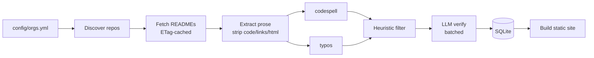

# Architecture

An interactive C4 diagram version of this document is published as an artifact:
<https://claude.ai/code/artifact/9c5f9f3f-ac09-4cdb-878c-f0071e4fc24b>

## Context

The system reads the public READMEs of large open-source orgs, finds genuine typos, verifies
them, and publishes findings to a static dashboard. Constraints: **personal project, $0 spend,
no paid services.**

- **Language:** Python 3.12
- **Delivery:** a scheduled job builds a SQLite DB + static HTML, published to GitHub Pages
- **Detection:** curated misspelling dictionaries (`codespell` + `typos`) plus a free-tier LLM
  verification pass to cut false positives

## Tech stack

| Concern | Choice | $0 note |
|---|---|---|
| Language / packaging | Python 3.12, hatchling | — |
| CLI | Typer | `init-db`, `orgs`, `discover`, `fetch`, `check`, `verify`, `report` |
| GitHub access | GraphQL via `httpx`, auth with a free Personal Access Token | 5000 pts/hr |
| Retry/backoff | `tenacity` | — |
| Markdown parsing | `markdown-it-py` + `mdit-py-plugins` | strip code/links/HTML before checking |
| Spell check | `codespell` (curated list) + `typos` (Rust, fast) — cross-referenced | no API keys |
| LLM verification | Google Gemini free tier (default), Groq, or local Ollama — pluggable | only survivors, batched |
| Database | SQLite (`sqlite3`) | see below |
| DB access | SQLAlchemy 2.0 Core + Alembic | portable if we ever move to Postgres |
| Config | `pydantic` v2 + `pyyaml` | — |
| Dashboard | Jinja2 static HTML + `datasette-lite` (SQLite in-browser via WASM) | no backend |
| Scheduler / compute | GitHub Actions cron | free for public repos |
| Hosting | GitHub Pages | free |
| Lint / test | ruff, pytest | — |

## SQLite vs Postgres

**Use SQLite.** PostgreSQL the software is free; you only pay for a *managed host* (RDS, Cloud
SQL). Free Postgres tiers exist (Supabase, Neon) but add an account, a network hop, connection
limits, and cold starts — pure downside for a $0 batch project.

SQLite fits this workload exactly:

- **Single writer:** one nightly crawler writes; everything else reads.
- **Small data:** a few thousand repos per org, one README each, ~10k–50k findings. Megabytes.
- **Zero infra:** one file — commit it, ship it as a CI artifact, load it into `datasette-lite`.
- **Enough features:** transactions, FTS5, JSON functions, `ON CONFLICT` upserts.

Switch to Postgres only for concurrent writers, multiple app servers, a multi-user web app, or
>~100 GB. SQLAlchemy Core + Alembic keep that migration mechanical.

## Pipeline (batch, resumable)

Each stage is idempotent and checkpoints to the DB, so a run interrupted by a rate limit or a
CI timeout resumes instead of restarting.



## Database schema

```sql
orgs(id, login UNIQUE, added_at)

repos(id, org_id FK, full_name UNIQUE, default_branch, stars,
      is_archived, is_fork, pushed_at,
      readme_path, readme_blob_sha, readme_etag, last_checked_at)

readme_snapshots(id, repo_id FK, blob_sha, fetched_at, raw_md, extracted_text,
                 UNIQUE(repo_id, blob_sha))

findings(id, repo_id FK, blob_sha, line_no, col, token, suggestion, context_snippet,
         source,           -- codespell | typos | both
         heuristic_score,
         llm_verdict,      -- typo | not_typo | unsure | null
         llm_correction,
         status,           -- new | confirmed | false_positive | fixed
         first_seen_at, last_seen_at,
         UNIQUE(repo_id, token, line_no, blob_sha))

crawl_runs(id, started_at, finished_at, repos_scanned,
           api_points_used, findings_new, findings_confirmed)
```

## False-positive control

The hard part. Layered defense:

1. Parse markdown; drop fenced code, inline code, URLs, link targets, image alt/badges, HTML.
2. Trust a finding only when `codespell`/`typos` agree (or one flags it *and* the suggested fix
   is a common dictionary word).
3. Global + per-repo allowlists (product names, CLI flags, non-English author names).
4. Skip `ALLCAPS`, `CamelCase`, tokens with digits/underscores, tokens matching repo identifiers.
5. LLM-verify only the survivors — batched, "genuine typo in context? correction?".

## Politeness

Read-only. No auto-PRs in v1 (dashboard only). If PRs are added later: manual review gate, low
volume, opt-out list, one PR per repo max.
